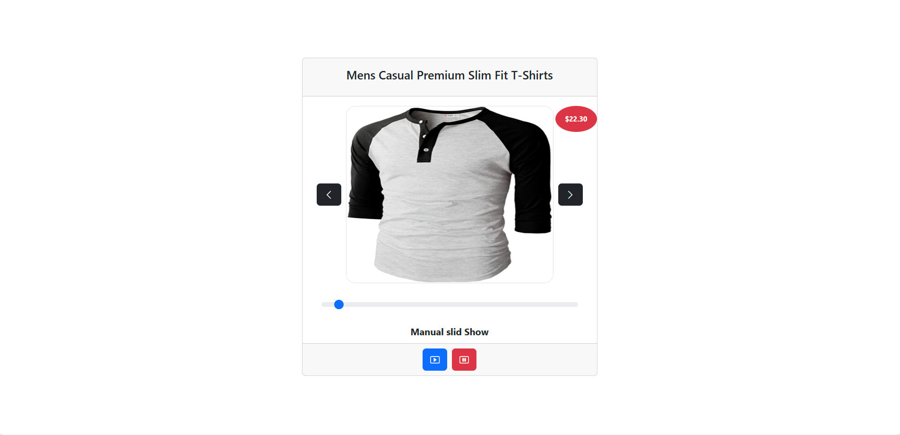

# 🛍️ React Product Carousel

A responsive React carousel component that fetches product data from [FakeStoreAPI](https://fakestoreapi.com) and displays products with support for:

- Manual navigation (Next/Prev buttons)
- Range slider control
- Auto slideshow with Play/Pause
- Price badges and product images

---

## 🚀 Features

- 📦 Fetches product details using Axios
- ⏯️ Manual and automatic slide navigation
- 🎚️ Range slider to jump to any product (1–20)
- 💰 Price badge overlay
- 🧠 Uses React Hooks: `useState`, `useEffect`, `useRef`
- 🎨 Styled using Bootstrap 5 and Bootstrap Icons

---

## 🧑‍💻 Tech Stack

- **React**
- **Axios**
- **Bootstrap 5**
- **FakeStoreAPI**

---

## 📸 Demo


---

## 📸 Screenshot




---

## 📂 Project Structure

```bash
src/
├── components/
│   └── Carousel.js
├── App.js
└── index.js
```


## 🧑‍💻 Author

**Sachin Parashetti**  

[](https://github.com/SachinParshetti)
[](https://www.linkedin.com/in/sachin-parashetti-99b255259)
[](mailto:sachinparshettisp@gmail.com)